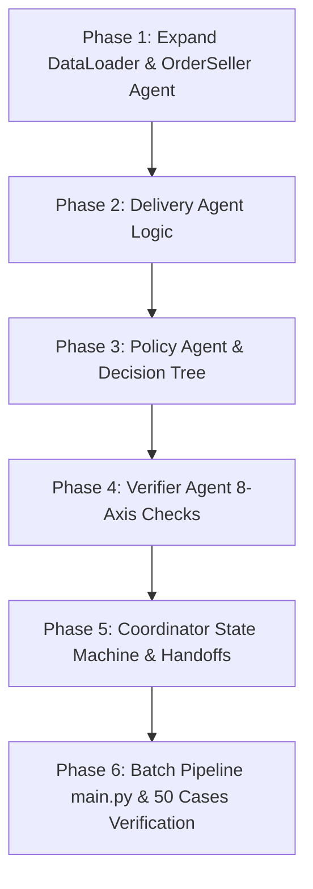

# Implementation Plan: Full Multi-Agent A2A E-commerce Investigation System

## Overview
Kế hoạch triển khai toàn bộ các agent nghiệp vụ trong hệ thống Multi-Agent A2A Olist theo phương pháp **Vertical Slicing & Test-Driven Development (TDD)**. Các mô-đun được xây dựng theo trật tự từ tầng nền tảng truy xuất dữ liệu $\to$ domain agents $\to$ policy/verifier agents $\to$ coordinator $\to$ batch integration, đảm bảo mỗi bước đều có thể thi hành kiểm chứng độc lập.

## Architecture Decisions & Principles
1. **Financial Determinism:** Duy trì sử dụng `Decimal` và làm tròn 2 chữ số thập phân (`ROUND_HALF_UP`) trong mọi agent có tính tiền (`order_seller`, `policy`, `verifier`), đồng bộ 100% với `payment_agent`.
2. **Anti-Cartesian Data Separation:** Nghiệp vụ tra cứu từ Olist CSV trong `OlistDataLoader` sẽ được mở rộng thêm bộ nhớ đệm `_orders_cache`, `_sellers_cache` và `_products_cache`, không join bảng thô.
3. **Decoupled Handoffs:** Các Domain Agent (`OrderSeller`, `Payment`, `Delivery`) hoàn toàn độc lập, giao tiếp dưới phong bì hợp đồng `AgentTask` và trả về `AgentResult`.
4. **Deterministic Policy Matching:** `Policy Agent` xử lý danh sách 6 rule tĩnh ưu tiên từ cao xuống thấp, không phỏng đoán bằng văn phong LLM.
5. **Gated Output Writing:** Cánh cửa ghi vào thư mục `output/` thuộc về `Coordinator Agent` và chỉ được mở sau khi có `verdict: "PASS"` từ `Verifier Agent`.

---

## Roadmap & Vertical Slices

### Phase 1: Expand Data Loader & Order-Seller Agent
- Mở rộng `OlistDataLoader` với các hàm lấy order, seller, product và viết test cho tính năng mới.
- Triển khai `OrderSellerAgent` tại `agents/order_seller_agent.py` và kiểm thử tự động tại `tests/test_order_seller_agent.py`.
- **Checkpoint 1:** Kiểm tra tính tổng `item_total_brl` và `freight_total_brl`, xác định seller vi phạm thời hạn bàn giao (`handoff_after_limit`).

### Phase 2: Delivery Agent
- Triển khai `DeliveryAgent` tại `agents/delivery_agent.py` và kiểm thử tự động tại `tests/test_delivery_agent.py`.
- **Checkpoint 2:** Kiểm chứng phân chia trách nhiệm `attribution_candidate` (`seller`, `logistics_provider`, `none`, `not_applicable`, `unknown`).

### Phase 3: Policy Agent
- Triển khai `PolicyAgent` tại `agents/policy_agent.py` và bộ test TDD `tests/test_policy_agent.py`.
- **Checkpoint 3:** Kiểm tra 6 luật của `EC_POLICY_V1`, cờ `excluded_higher_priority_rules` và tính chính xác số tiền hoàn `recommended_refund_brl`.

### Phase 4: Verifier Agent
- Triển khai `VerifierAgent` tại `agents/verifier_agent.py` và bộ test TDD `tests/test_verifier_agent.py`.
- **Checkpoint 4:** Kiểm tra 8 trục giám sát (`schema`, `identity`, `entities`, `evidence`, `financials`, `policy`, `limits`, `determinism`), xác minh cắt mảng tối đa 5 entity và 10 evidence.

### Phase 5: Coordinator Agent
- Triển khai `CoordinatorAgent` tại `agents/coordinator.py` và bộ test TDD `tests/test_coordinator.py`.
- **Checkpoint 5:** Kiểm thử luồng quản lý trạng thái (`RECEIVED -> ... -> WRITTEN`), điều phối fan-out tới 3 domain agent, xử lý xung đột chéo (`DOMAIN_TOTAL_CONFLICT`), gửi Policy và xin cấp phép từ Verifier.

### Phase 6: Full Batch Integration (`main.py`) & Audit Logs
- Triển khai tệp thực thi chính `main.py` để quét và giải quyết trọn bộ 50 file từ `input/EC_001.json` tới `EC_050.json`.
- Xuất kết quả vào `output/EC_001.json` - `output/EC_050.json`, ghi nhật ký giao ca vào `logging/trace.jsonl` và thông tin model/runtime vào `logging/metadata.json`.
- **Checkpoint 6:** Chạy thực tiễn 50 cases và xác định 100% đạt trạng thái PASS.

---

## Risks and Mitigations

| rủi ro | Mức độ | Chiến lược giảm thiểu (Mitigation) |
| :--- | :--- | :--- |
| **Xung đột làm tròn tiền BRL giữa OrderSeller và Payment** | Cao | Tất cả các agent đều nhập khẩu bộ tiện ích tính toán `Decimal` và cờ làm tròn `ROUND_HALF_UP`, tuyệt đối không tự ý dùng `float(a + b)`. |
| **Bùng nổ bộ nhớ hoặc I/O khi chạy 50 cases liên tiếp** | Trung bình | `OlistDataLoader` sử dụng bộ đệm nhàn rỗi O(1) in-memory index; dữ liệu CSV chỉ đọc 1 lần duy nhất trong toàn chặng chạy batch. |
| **Rò rỉ thông số trace vào file JSON nộp bài** | Cao | `CoordinatorAgent` dựng đối tượng `draft_output` sạch theo đúng hợp đồng mục 12, cách ly hoàn toàn với mảng log của `trace.jsonl`. |
| **Sai lệch định dạng thời gian ISO-8601** | Tháp | So sánh chuỗi trực tiếp hoặc parse cẩn trọng theo chuẩn CSV Olist, không thực hiện chuyển đổi múi giờ tùy tiện. |
